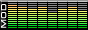

::: dictionary
1. *(Greek) "cloven," "divided," or "that may be split or cleft"*
2. *A coarse-grained metamorphic rock which consists of layers of different minerals and can be split into thin irregular plates.*
:::

Hello! I\'m hosted with GitHub Pages. You can check my GitHub
repositories [here.](https://github.com/mxisto)

::: homebox
## Linux

<a href="./linux/low-end-streaming.html">Online Media Streaming tips on Low End Hardware</a>

<a href="./linux/slack_server_guide.html">Simple NAS with Slackware Linux</a>

<a href="./linux/slack-stone-soup.html">Building and compiling Dungeon Crawl Stone Soup with graphical tiles on Salix/Slackware</a>

### Software
[Using Geany custom build commands for Rmarkdown and other filetypes](./linux/geany-custom-filetypes.html)

## Math

<a href="./math/equality_principle.html">Equality Principle</a>

<a href="./math/equivalent_fractions.html">Equivalent Fractions</a>

<a href="./math/system_of_equations.html">Systems of Equations</a>

### Operational Research
<a href="./math/operational-research/operational-research-index.html">Operational Research - Exercises</a>

## Misc.

<a href="./custom/ascii_gallery.html">ASCII Gallery</a>

<a href="./books/books-list.html">My book list (WIP)</a>

<a href="./custom/bst-archive.html">Battlestations Archive</a>

<a href="./custom/wallpaper-archive.html">My Wallpaper Archive</a>

:::
---

More Stuff soon!

Here is some of my interests and what you may find in this website (in
the future):

- Linux 
- Retro Stuff
- Programming
- Statistics
- Math

------------------------------------------------------------------------

[Qalculate!](https://qalculate.github.io/) | [GitHub Pages](https://pages.github.com/)

::: {style="text-align: center;"}

  
  
  
  
  
  
  
  
  
  
  
  
  
  
  
  
  
  
  

:::
