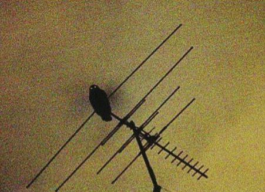

::: {style="text-align:center;"}
σχιστός (schízein) \| schistós \| skhistos \| xisto

::: dictionary

```{=html}
<!-- -->
```
:::

------------------------------------------------------------------------
:::



::: {#table_index style="padding:2%; text-align: center;"}
Hello! I\'m hosted with GitHub Pages. You can check my GitHub
repositories [here.](https://github.com/mxisto)

## **Linux**

------------------------------------------------------------------------

[Online Media Streaming tips on Low End
Hardware](./linux/low_end_streaming.html)

[Simple NAS with Slackware Linux](./linux/slack_server_guide.html)

## **Math**

------------------------------------------------------------------------

[Equality Principle](./math/equality_principle.html)

[Equivalent Fractions](./math/equivalent_fractions.html)

[Systems of Equations](./math/system_of_equations.html)

### **Operational Research**

<div>

[Operational Research -
Exercises](./math/operational-research/operational-research-index.html)

</div>

## [Misc.]{.underline}

------------------------------------------------------------------------

[My book list (WIP)](./books/books_list.html)

[My Wallpaper Archive](./custom/wallpaper_archive.html)

[ASCII Gallery](./custom/ascii_gallery.html)
:::

::: {style="text-align: center;"}

------------------------------------------------------------------------

More Stuff soon!

Here is some of my interests and what you may find in this website (in
the future):

Linux \| Retro Stuff \| Programming \| Statistics \| Math

{height="" width=""}

------------------------------------------------------------------------

[Qalculate!](https://qalculate.github.io/) \|
[MathJax](https://www.mathjax.org/) \| [Easy Copy
MathJax](https://easy-copy-mathjax.nakaken88.com/en/) \| [GitHub
Pages](https://pages.github.com/) \$\$\\LaTeX\$\$

------------------------------------------------------------------------
:::

::: {style="text-align: center;"}
<div>

{width="88"
height="31"} {width="88" height="31"}

[{width="88"
height="31"}](https://www.dosbox.com/)
[](https://archive.org/)
[](https://modarchive.org/)
[](https://linuxmint.com/)
[](https://archlinux.org/)
[{height="31"}](https://www.gog.com)
[](https://geany.org/)

</div>

<div>

[](http://www.slackware.com/)

</div>
:::
