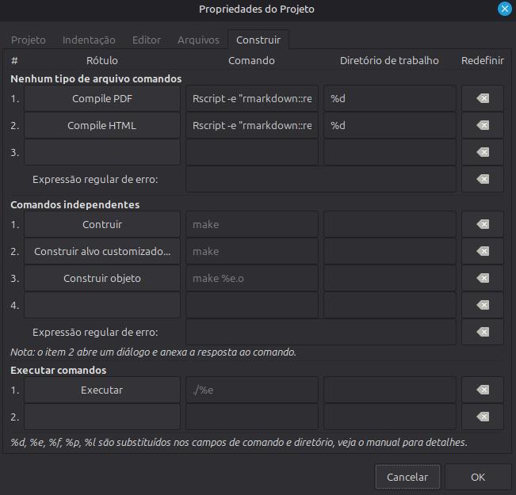
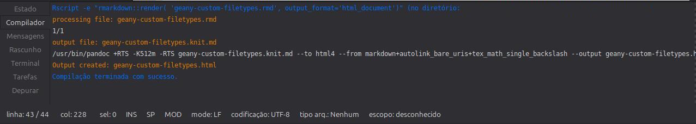

[\<\-\-\-\-- Back to Index](../index.html)

<center>


</center>

<br></br>

[Geany](https://www.geany.org) is a great and lightweight IDE that provides good support for a great selection of filetypes. However for more specific types of files such as Rmarkdown (.rmd) there are not such options as default, so in this case we need to set our own build instructions.

Luckily Geany supports custom build instructions for know and unknown filetypes. I use it for building HTML pages from Rmarkdown for this website.

**In this example we will see how to set a custom command for building web pages from Rmarkdown:**

First I assume that you already installed [R](https://www.r-project.org/) in your system and installed the **rmarkdown** package via **R** as superuser.

Then we will open an .rmd file. On the upper menu, go to **Build --> Define Build Commands...**:

<center></center>
<br></br>
In the specific case of Rmarkdown, I need to compile it using an specific command:

:::codeblock
```bash
Rscript -e "rmarkdown::render( '%f', output_format='html_document')"
```
:::

For creating other outputs (i.e. PDFs), it's just the case of replacing the output value in `output_format=[...]`.

The substitutes are important! According to [Geany documentation](https://wiki.geany.org/howtos/configurebuildmenu):

- **%f** - replaced by the filename of the file selected in the editor when the menu item is selected.
- **%e** - replaced by the same filename but without the last extension.
- **%d** - replaced by the absolute path of the directory of the file selected in the editor when the menu item is selected.
- **%p** - replaced by the absolute path of the base directory of the currently open project.

So this command will always run in the working directory in order to read the files needed, they will show up in the **Build** upper menu as options. In this situation I've put them in the default function keys for quick access (F8 for PDFs, F9 for webpages).

<center></center>
<br></br>
So when you run it, the message will be sent to the compiler textbox like if you were to compile any other program.

_**Tip: If you're using a standalone compiler binary (i.e. FreePascal's fpc), you can write the file's location (in an absolute path) directly into the command box.**_

***

Other editors like **Vim** also have the ability to set custom commands and bind them into keys. However if you prefer the middle ground between an text editor and a full bloated IDE, Geany is a good option for that.
